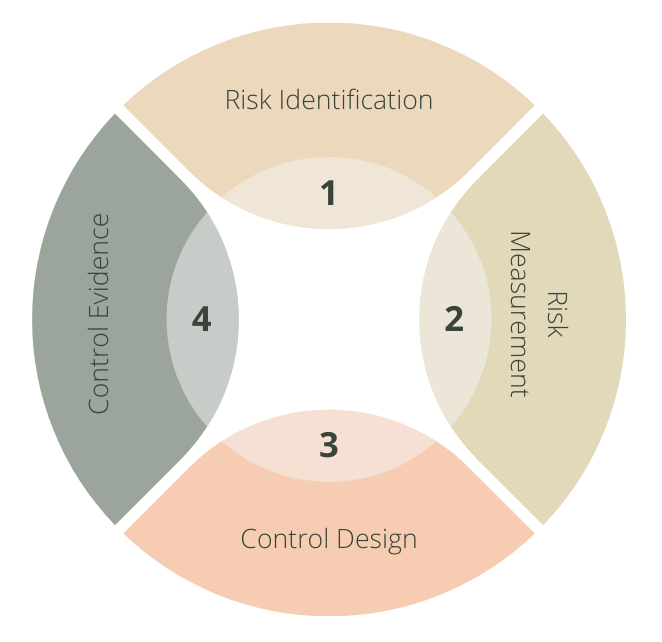

<h1 align="center">A Primer on Compliance and Controls</h1>

Time to read: 7 minutes

  
## 30 Second Overview
This memo provides a baseline understanding of compliance and controls and an introductory strategy to build a modern compliance management system.  The anticipated outcome is a mapping of controls to risks and a system that helps partners leverage compliance information in their decision-making.

1. Compliance systems have both internal and external requirements
2. We use systems to support compliance at scale
3. Modern compliance has a surprising number of intersections with software engineering practices
4. Some unique aspects of compliance testing can be frustrating
5. Our strategy uses risk measurement to build controls that are right-sized (not one-size-fits-all)
6. The Security Technology Assurance & Risk (STAR) team is here to help: ask questions and please share direct feedback

## What do we mean when we say "compliance?"

Think of compliance in two buckets.  The first bucket is what happens within Netflix.  The second bucket deals with external laws and regulations.  We call this **regulatory compliance**. Many regulations are well established:

* Payment Card Industry Data Security Standard (PCI DSS 2004)
* General Data Protection Regulation (GDPR 2016)
* California Consumer Privacy Act (CCPA 2018)

Hundreds of other country and state specific compliance regulations also apply. Consumer demand drives the creation of new regulations.

**Regulatory compliance is not optional.  We abide by all laws in each jurisdiction where we operate.**

Internal compliance refers to the frameworks we use to build helpful  systems.  The [Privacy Policy](https://help.netflix.com/legal/privacy) is the cornerstone to internal compliance and it explains how we uphold our commitments to our members. Other helpful inputs are the [Culture Memo](https://jobs.netflix.com/culture), Security Program, and Code of Conduct.1

## Is compliance contrary to "people over process?"

In some ways it is.  Compliance is a set of processes and prescriptions that we must follow.  External parties write  regulations as all-or-nothing mandates. Regulations tend to apply to companies of all sizes and industries.

Due to the scale and complexity, it's not workable for each team to handle compliance on their own. We work to build helpful systems to give support and lift all teams. The STAR team works hard to make the complex simple. We build processes that help teams get more done and we strive to create more informed captains.

The Culture Memo lists PCI and financial confidentiality as examples where Netflix relies on processes and controls. World-class compliance systems are grounded in helping the business achieve its objectives, minimize financial loss, and do the right thing for customers.  That's a winning combination.

At Netflix, we seek to apply engineering principles to address compliance.

## Compliance is like software engineering2

Software engineering and compliance have more in common than you might think.

1. Defects cost more to fix the later they are discovered.  This is the same with controls.  Designing and implementing controls early costs less.
2. Optimize. Look to cut waste by automating as much as possible. Compliance controls can and should be automated.  An automated control is better than a manual control.
3. Write once, run many.  A well designed and written software block is reusable. The best controls scale across platforms and compliance frameworks. They allow others to rely upon and inherent the provided value.
4. Use instrumentation to your advantage. Just as you use logging to monitor app performance, use logging and data to watch your compliance environment. Robust logging can make compliance much easier.
5. Decoupled administration processes help maintain your app. You may already have asynchronous jobs that clean up and compress tables or other helpful performance tasks. Admin processes can also run controls and capture evidence so you spend less time interfacing with auditors while proving compliance adherence.
6. Plan for chaos.  Chaos engineering anticipates infrastructure failures and helps with hardening.  Assume things will go wrong. Your controls help prevent issues and help with early intervention for faster recovery.
7. As you think about software resiliency engineering (*What are all the ways my app could break?*) apply that same thinking to assessing the risks to your application or infrastructure. Start by brainstorming adverse scenarios then rank the likelihood × impact as a simple way to start risk ranking.3 Then consider a few stretch questions: Do we process customer payment information? Do we store non-public customer information? Are we internet facing (or can we rely on other internal network or platform controls on a pre-existing "paved path")? These tend to be higher risk scenarios that benefit from greater attention to control definition and build out.
8. Proactive beats reactive.  Push beats pull. At regular intervals, how can you capture evidence of compliance and share back to a central repository for audit review? Use internal APIs to your advantage by helping build a centralized inventory of risks, controls, and control evidence.4
9. Do you provide a horizontal or shared service that others rely on? These present tremendous opportunities to build paved paths that others can use.

## Why can compliance be so frustrating?

Most people don't walk around thinking about how they can prove they are following the law.  For example: it would be difficult to present evidence that proves you drove below the speed limit on your last road trip. This is what must be done in software compliance.  You must show how you are meeting the standards of the various compliance regulations using actual evidence.  This is backward from every day living.

A practical methodology includes risk identification and measurement, control design and control evidence.

### Time-boxed

Most people can't remember what they had for dinner three nights ago, let alone three months ago.  Control testing is usually time bound and the testing window can lag in the past -- too far in the past to remember offhand. You have to build a durable system that can pull back old evidence rather than just show how you're doing it today.

### Documentation actually helps

The [agile manifesto](https://agilemanifesto.org/) demands "working software over comprehensive documentation." Paradoxically, this is an area where *some* documentation about the design of a control can save future hours of effort. Your future-self will thank you.

### Everyone is on the same team

Compliance testing can turn stressful.  Demonstrating compliance can be difficult for product teams.  Internal auditors have a tough job, too. Despite the moments of stress, remember everyone is on the same team and wants to do what's best for the customer and Netflix.  Internal competition among teams distracts from pleasing the customer.

## What is our risk and control strategy?

It is common for companies to adhere to many different compliance frameworks. Netflix operates in 190 different countries. It is impossible for one person to know all the different laws and regulations that apply to a particular application. Instead, a risk assessment system and an inventory of controls with traceability to regulations is used. Everything does not need the same level of controls. The system fights the python of process by calibrating controls with the level of risk.

Think of a **control** as any system or procedure that helps improve the likelihood of the business achieving its objectives. Common examples of controls for cloud-based companies include: access management, encryption, safe storage of customer information, and logging and monitoring to confirm that services work as intended. Engineers and product teams tend to be very security conscious already. These teams use a multitude of controls to do the right thing for the customer, but have never used the term "control."  Control is a strange name for a familiar concept.

### There are different types of controls:

* **Automated preventative** controls are the best. They block bad things from ever happening. They're built once and can run for a lifetime.
* **Automated detective** controls are good and use log files, instrumentation, and telemetry to identify and help when something seems fishy.  They can help cut disruption and reduce downside impact.
* **Manual detective** controls need human intervention to figure out what happened. With some exceptions,5 these controls are too expensive, too slow, and don't work well at the scale of Netflix.
* **Directive** controls equate to telling someone what to do or not to do.  Avoid this type of control as it runs contrary to the Netflix culture of people over process.

Automated controls allow for the efficient and systematic gathering of evidence.  Automation gives momentum to control reuse. A minimum number of controls can be used to satisfy a maximum number of compliance frameworks and obligations. That's the goal.

Our strategy allows us to measure risk, build effective controls and provides the organization with a top line view of risk levels. This gives our partners more clarity into how they can use risk as a helpful input into developing business strategy.

## Measuring outcomes and impact

It is hard to track when something *doesn't* occur. This makes the measurement of a compliance system difficult.  Life is made up of close calls.  When bad things *don't happen* you usually never know it. Expect to maintain a compliant environment, but error prevention is not the goal. Netflix is not in a safety-critical business.6 If too much error prevention hinders inventive, creative work, then the system is not working.

Measurements should focus on the quality and efficiency of the entire system and the clarity provided by risk assessment as a tool to help with business strategy formation and execution. **Our compliance management system will be most successful when it looks and feels like other products engineers enjoy using.**

Process success is informed by those that actually use the process and live with it daily -- *not* by the process creators. Transparent and direct feedback from the community on how it's going and how it could go better is expected.

## Bonus: Doesn't all this work on compliance slow us down?

Engineering teams spend time to brainstorm and architect an approach before building a new feature. This is to save time in the long-run.  Time spent designing scalable compliance controls saves time in the long-run, too. Not being purposeful in the design of controls can definitely impair time-to-production.

Applying sound engineering principles to compliance topics, taking ownership, and integrating controls into the software development approach saves time in the long-run. 

Lean on your Security Partners and especially the STAR team to translate the complex ecosystem of compliance into a defined set of actions.

## Finally

Compliance is iterative. A little bit of progress each day adds up to massive results. 

> Start where you are, use what you have, do what you can - Arthur Ashe

## Assumptions
1. I am making an assumption that there are internal policies to help guide expectations.

2. I drew a lot of inspiration for these ideas from the [12 Factor App](https://12factor.net/).

3. I assume that internally developed single page apps (SPAs) help guide engineers to identify risks and controls aligned with the The [FAIR methodology](https://www.fairinstitute.org/about).  I envision tools like these can help capture the results into an inventory. For simplicity, I suggest a basic starting point of likelihood × impact.

4. I assume internal APIs are in place (or can be put in place) to support the capturing of evidence from engineering teams.

5. Incident response is one of these exceptions and tends to be an excellent cost/value return on manual human effort.

6. Aircraft manufacturing for example.
